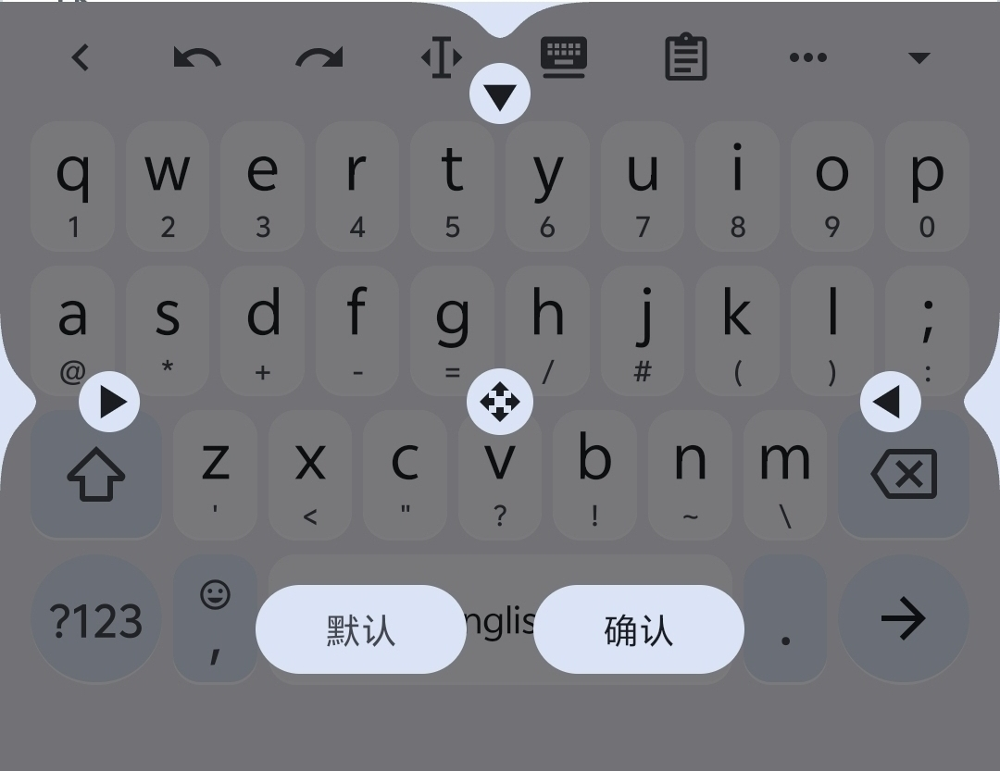

# 调整模式

::: warning 待补充
本页内容正在撰写修订中。
:::

调整模式（Adjust Mode）是一个临时可视化状态，允许你直接拖动键盘边缘、移动手柄修改键盘的尺寸与位置。

## 进入方式

- 正常非浮动键盘下：长按盘上方Kawaii Bar的"浮动键盘"按钮

## 调整方法

- 拖动上方手柄调整键盘高度（当前屏幕状态）
- 拖动左右侧手柄调整左右边距（当前屏幕状态）
- 拖动中间十字箭头手柄调整底部边距（当前屏幕状态）

## 保存与恢复

- 点击`默认`恢复程序默认尺寸设定（当前屏幕状态）
- 点击`确认`保存调整结果并退出调整模式
- 横屏/竖屏独立保存

## 相关页面

- [浮动键盘](/features/keyboard/float-keyboard)
- [键盘布局编辑器](/features/editor/layout-editor)
