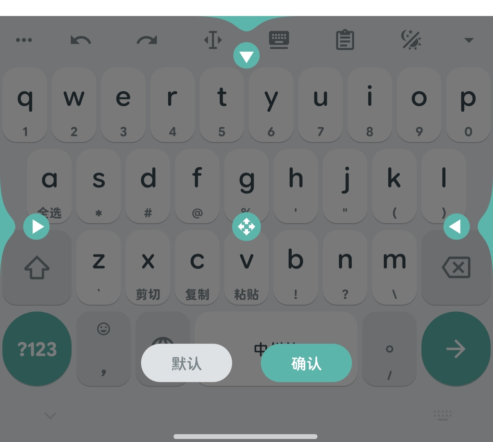

# 调整模式

调整模式（Adjust Mode）是一个临时可视化状态，允许你直接拖动键盘边缘、移动手柄修改键盘的尺寸与位置。

## 进入方式

- 正常非浮动键盘下：**长按工具栏（Kawaii Bar）上的「悬浮键盘」按钮**。

## 调整方法

- 拖动上方手柄调整键盘高度（当前屏幕状态）
- 拖动左右侧手柄调整左右边距（当前屏幕状态）
- 拖动中间十字箭头手柄调整底部边距（当前屏幕状态）

## 保存与恢复

- 点击 `默认` 恢复程序默认尺寸设定（当前屏幕状态）
- 点击 `确认` 保存调整结果并退出调整模式
- 横屏/竖屏独立保存

::: tip 与键盘高度设置的关系
键盘高度另有全局设置（**键盘 → 虚拟键盘** 的「键盘高度」/「键盘高度百分比」，后者默认按真实屏幕尺寸计算）；调整模式保存的是当前屏幕形态下的覆盖值，两者叠加生效。
:::

## 相关页面

- [浮动键盘](/features/keyboard/float-keyboard)
- [分体键盘](/features/keyboard/split-keyboard)
- [键盘布局编辑器](/features/editor/layout-editor)
