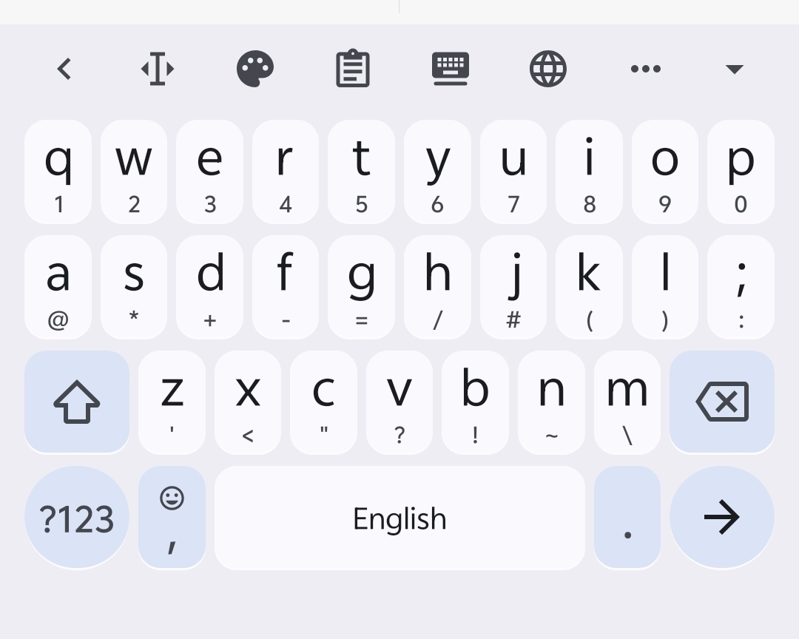
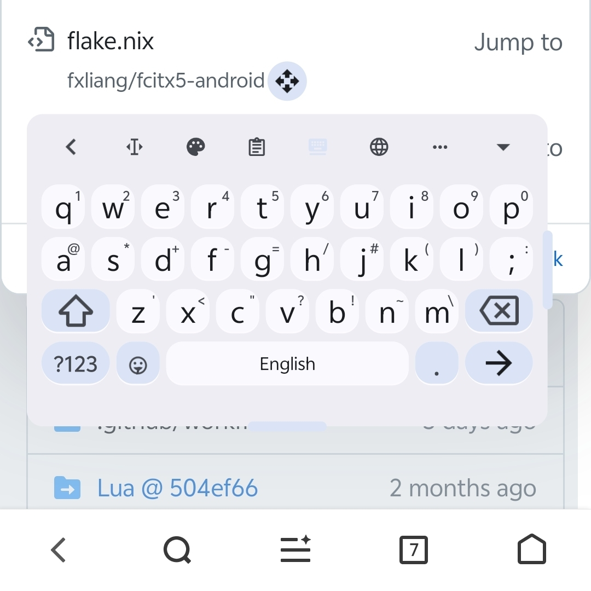

# 浮动键盘

::: warning 待补充
本页内容正在撰写修订中。
:::

fx 提供完整的浮动键盘形态。

## 启用方式

- 通过 Kawaii Bar 上的 **浮动键盘** 切换按钮一键切换

## 主要能力

- **任意位置摆放**：拖动键盘顶部的移动手柄
- **调整尺寸**：进入 **调整模式** 后可自由改变宽高，通过拖拽右侧和下方的调整手柄
- **横竖屏独立记忆**：分别保存横屏与竖屏的位置/尺寸

## 相关页面

- [调整模式](/features/keyboard/adjust-mode)
- [分体键盘](/features/keyboard/split-keyboard)
- [候选窗增强](/features/candidate-window)
