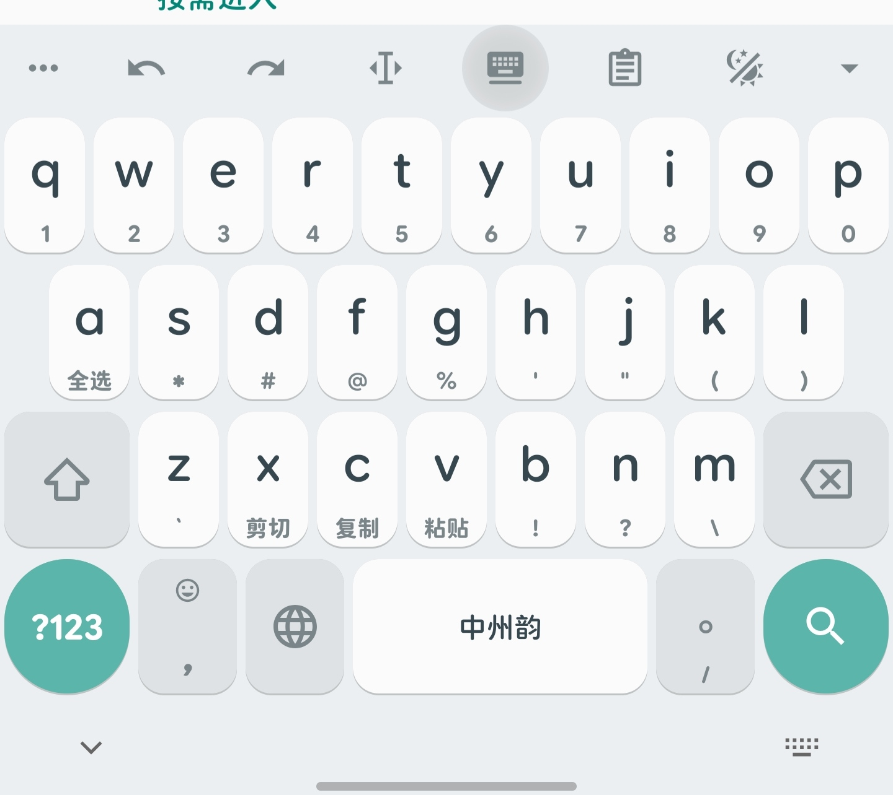
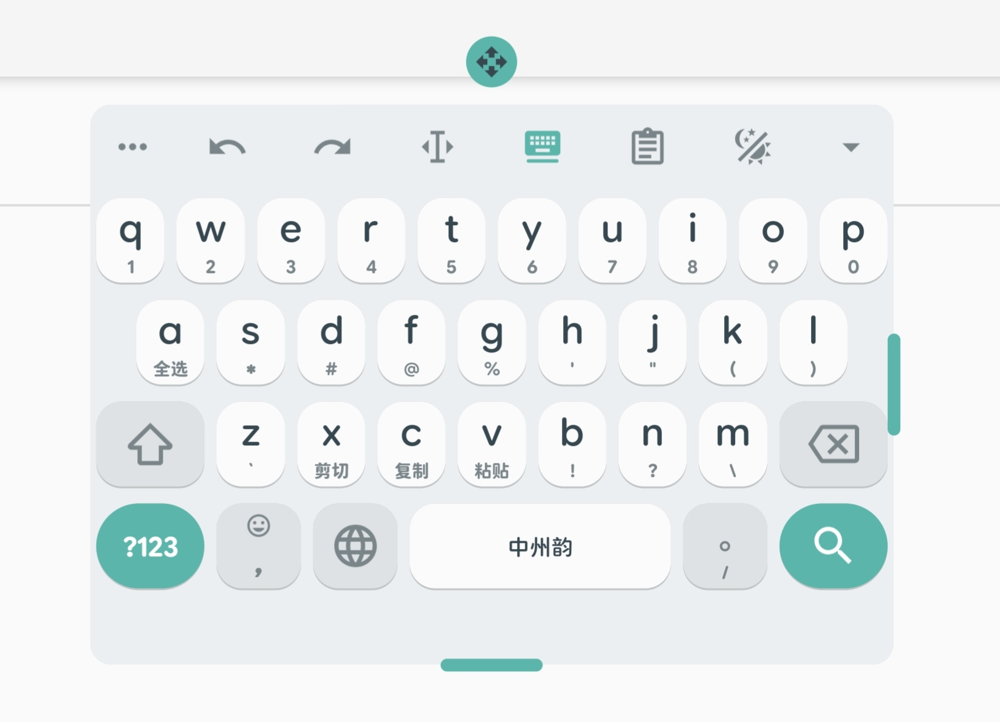

# 浮动键盘

浮动键盘脱离屏幕底部停靠位置，可任意拖动摆放、调整尺寸，适合分屏、平板悬空操作或遮挡内容时使用。

## 启用方式

- **工具栏（Kawaii Bar）上的「悬浮键盘」按钮**一键切换；
- **应用主页 → 键盘 → 分体、浮动与单手键盘 → 浮动键盘** 开关（2026-09-29 起设置页有独立入口，此前只能靠工具栏按钮）。

## 主要能力

- **任意位置摆放**：拖动键盘顶部的移动手柄；手柄贴近屏幕顶部空间不足时会自动翻到边缘下方，不会卡在半空
- **调整尺寸**：进入 **调整模式** 后拖拽右侧和下方的调整手柄
- **横竖屏独立记忆**：分别保存横屏与竖屏的位置/尺寸；横竖屏切换后按新方向恢复
- **横屏时自动使用浮动键盘**（设置同页开关，默认**关闭**）：转横屏自动换浮动、转回竖屏恢复原形态。两条边界：
  - 你已手动开启浮动或单手键盘时它**不介入**（尊重手动选择）；
  - **调整模式**下不介入，且它**永远不会改写你的手动形态偏好**——横屏只是临时借用，转回竖屏一定能恢复。

## 与其他形态的关系

- 浮动键盘与**单手键盘互斥**：开启其一会自动关闭另一个；与**分体键盘**的自动触发互不冲突（横屏自动浮动优先于自动分体时，以浮动为准）；
- 用开关关闭后，键盘恢复常规停靠状态；开关状态与工具栏按钮同步。

## 相关页面

- [调整模式](/features/keyboard/adjust-mode)
- [分体键盘](/features/keyboard/split-keyboard)
- [单手模式](/features/keyboard/one-handed)
