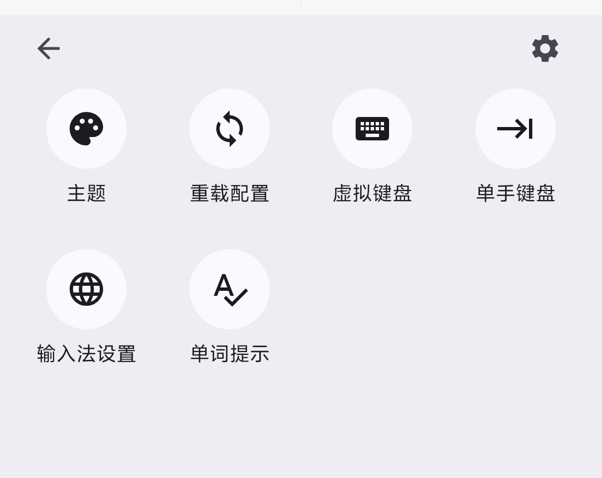
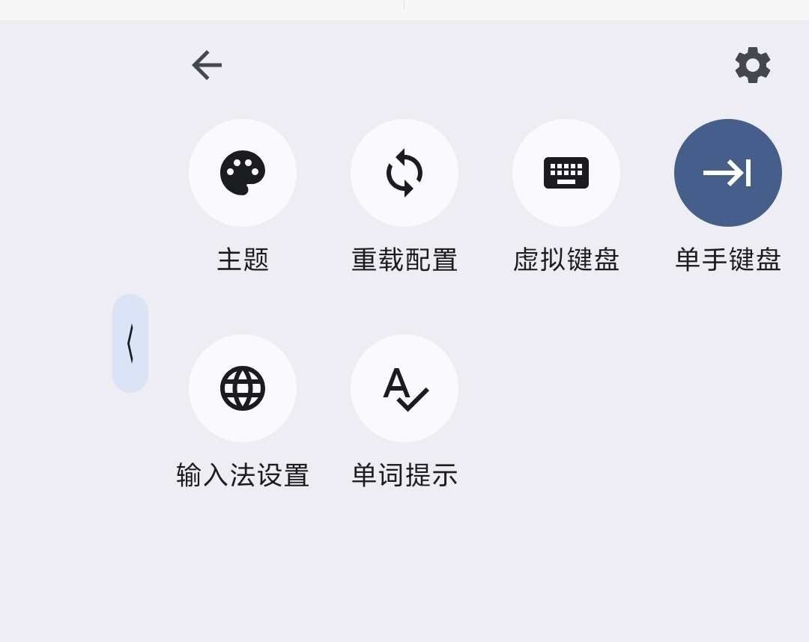
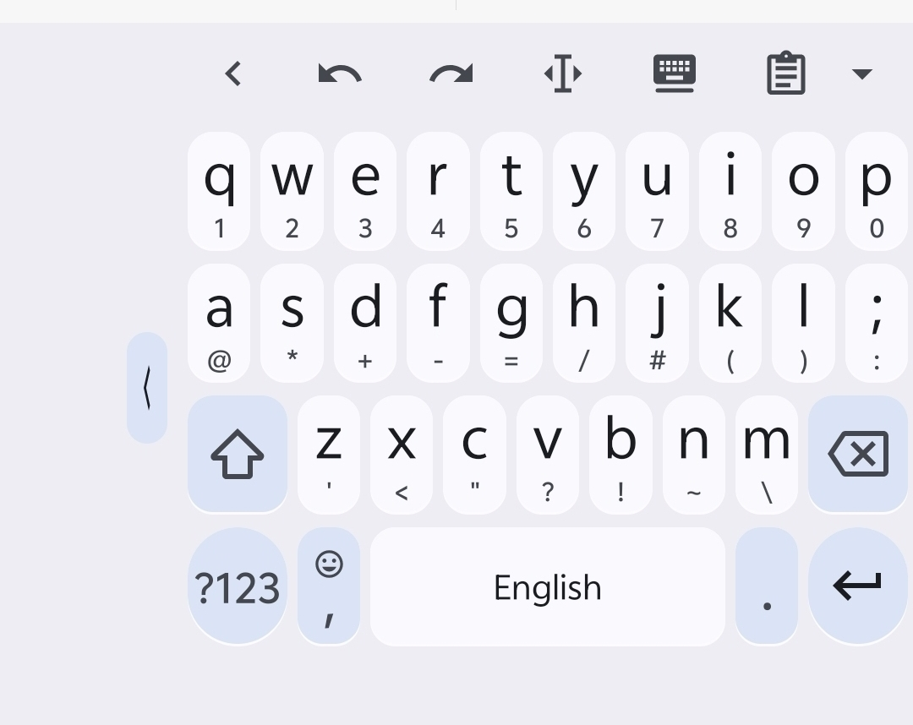
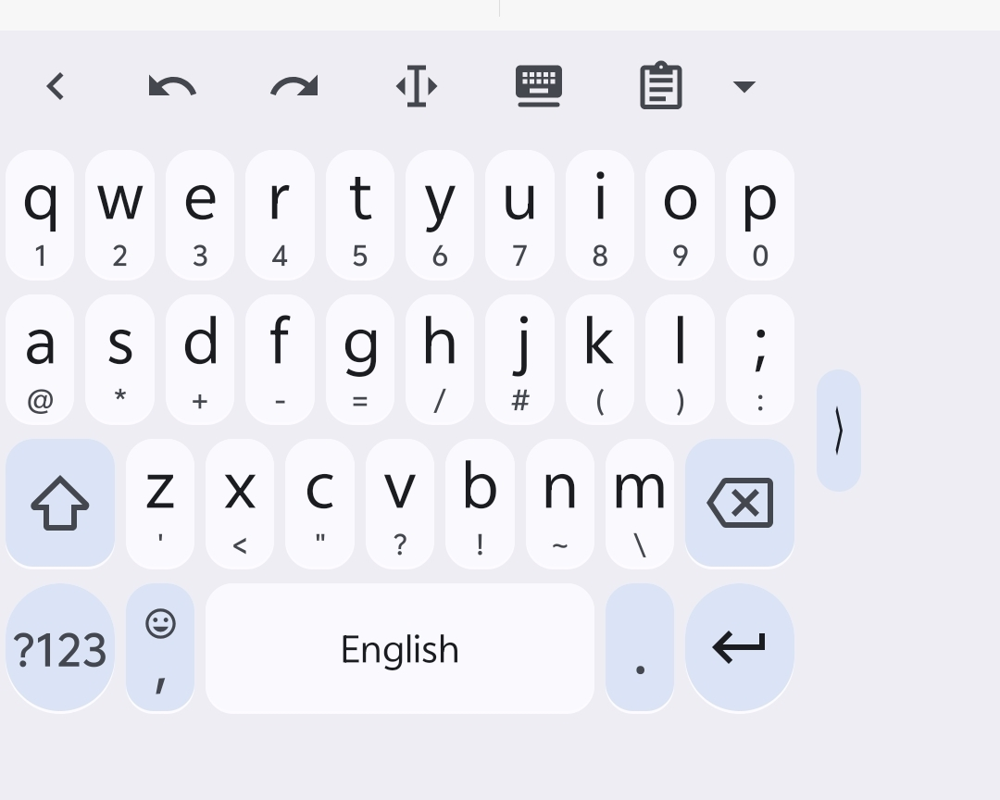

# 单手模式

::: warning 待补充
本页内容正在撰写修订中。
:::

适配大屏设备的单手输入模式，键盘整体收缩到屏幕一侧，并提供切换按钮。

## 启用与调整

- 通过 Kawaii Bar 或 Status Area 上的 **单手模式** 切换按钮一键切换
- 支持左/右手切换，并可调键盘宽度

 

 

## 与其他模式的关系

- 与浮动键盘 / 分体键盘互斥
- 切换回普通模式时记忆原调整整宽度

## 相关页面

- [浮动键盘](/features/keyboard/float-keyboard)
- [Kawaii Bar 增强](/features/kawaii-bar)
