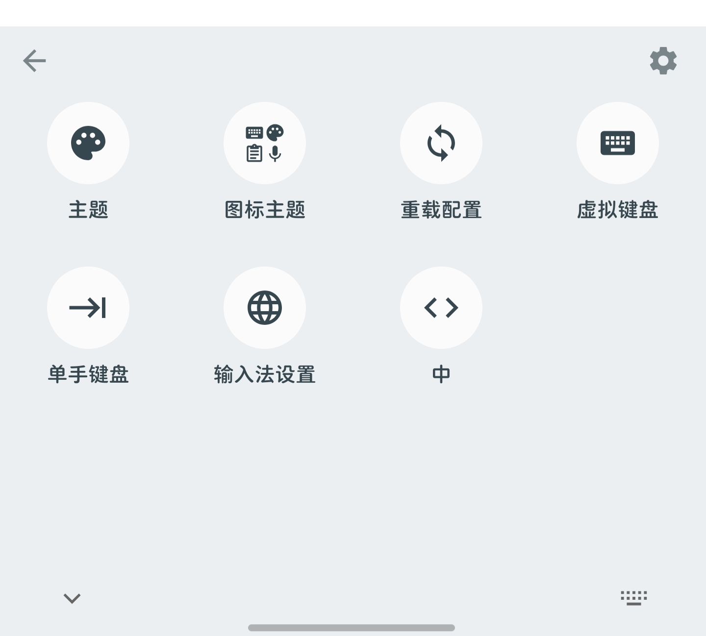
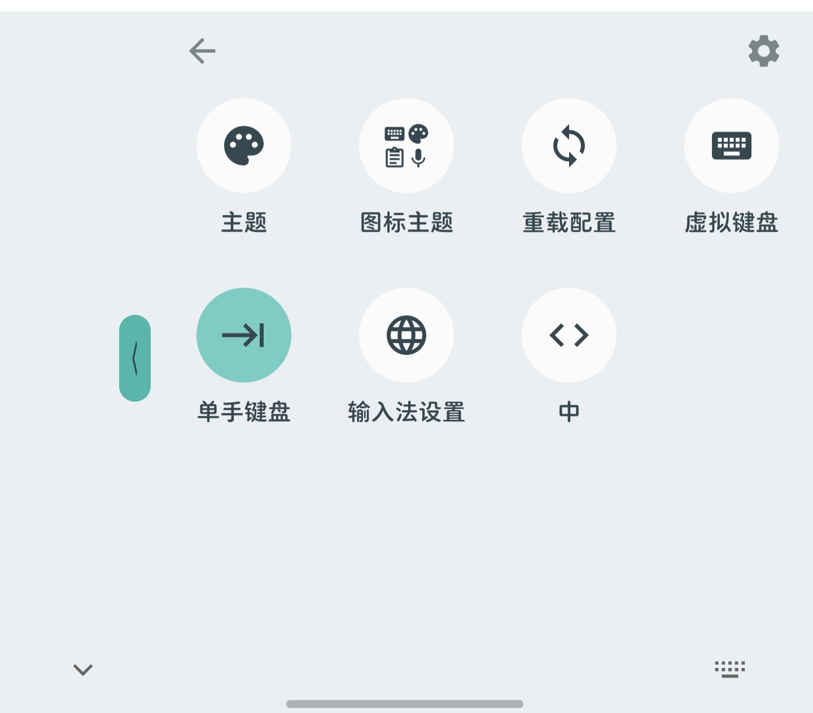
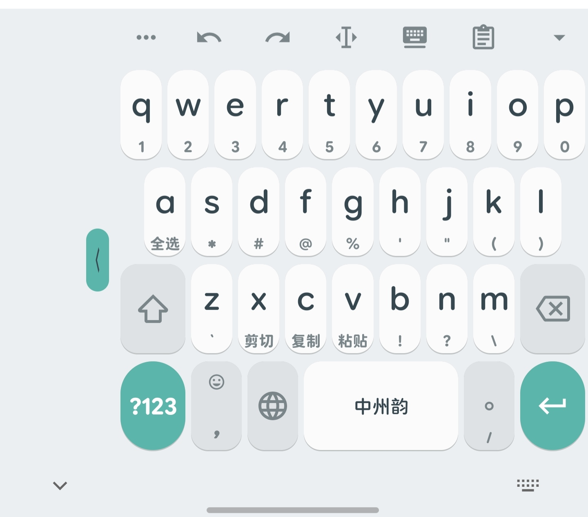
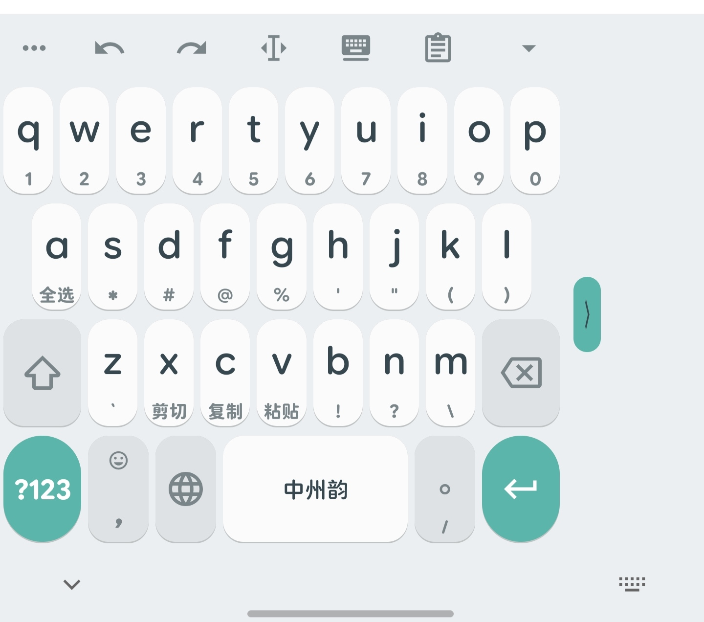

# 单手模式

适配大屏设备的单手输入模式：键盘整体缩窄到屏幕一侧，拇指更容易够到全部按键。

## 启用与调整

- **工具栏（Kawaii Bar）或状态区上的「单手模式」切换按钮**一键切换；
- **应用主页 → 键盘 → 分体、浮动与单手键盘 → 单手键盘** 开关（2026-09-29 起设置页有独立入口）；
- 支持左/右手切换，并可调键盘宽度。

## 与其他模式的关系

- 与**浮动键盘互斥**：开启其一会自动关闭另一个；开关状态与工具栏按钮同步；
- 用开关关闭后键盘恢复常规停靠；切回普通模式时恢复原来的宽度与布局；
- 手动开单手时，**横屏自动浮动不会介入**——它永远不覆盖你的手动选择。

## 相关页面

- [浮动键盘](/features/keyboard/float-keyboard)
- [分体键盘](/features/keyboard/split-keyboard)
- [Kawaii Bar 增强](/features/kawaii-bar)
