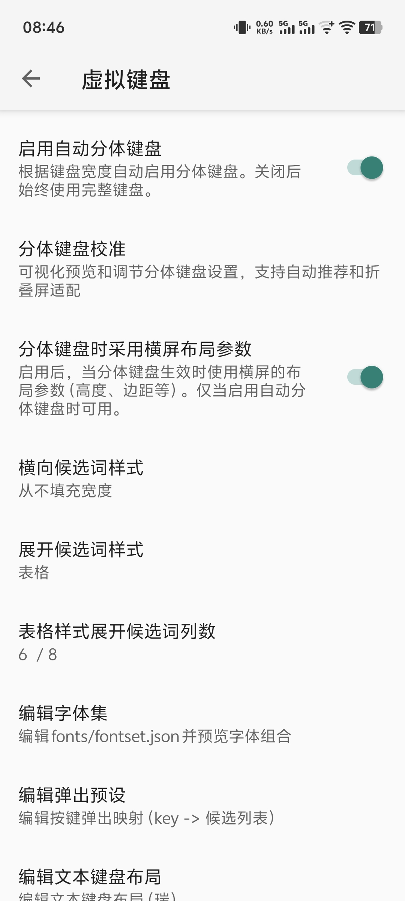
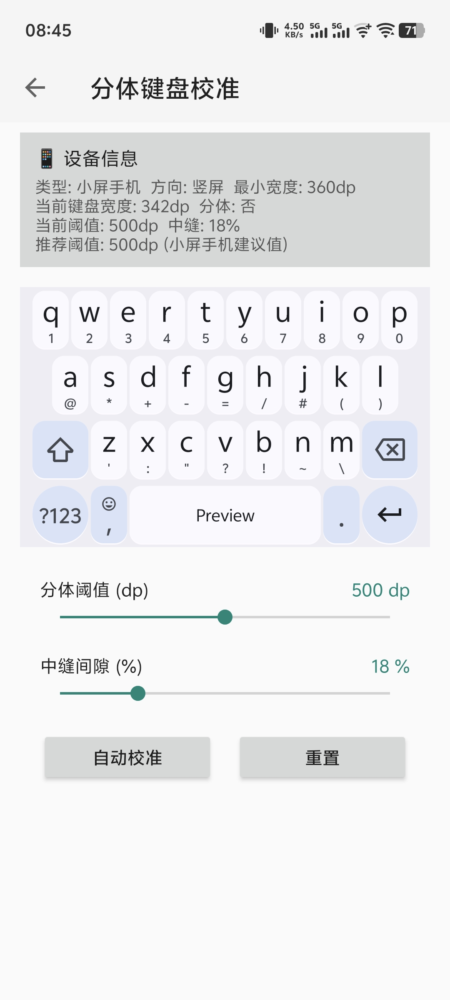

# 分体键盘

::: warning 待补充
本页内容正在撰写修订中。
:::

屏幕宽度DP值高的大屏场景下的分体键盘，两侧分别放置一半按键，便于双手握持设备时输入。

## 启用与配置

- 触发条件：屏幕宽度 DP 值超过一定阈值（默认 500）, `虚拟键盘->启用自动分体键盘` 开关开启后自动启用分体键盘
- 自动分屏阈值（自适应屏幕宽度）
- 分体键盘校准：可视化校准当前屏幕状态下分体阈值和中缝间隙参数，通常在算法自动推荐参数未如预期理想的情况下使用
- 分体键盘时采用横屏布局参数：触发分体键盘后，按横屏布局参数渲染键盘（边距、高度等），更适配大屏设备。尤其地，该选项对折叠屏内屏竖持时采用和横持时一样的参数设定

## 智能默认

fx 提供智能默认值，多数设备无需手动校准即可获得合理体验。如未如预期理想，可通过分体键盘校准功能调整参数获得更适合当前设备的体验。

## 相关页面

- [浮动键盘](/features/keyboard/float-keyboard)
- [调整模式](/features/keyboard/adjust-mode)
