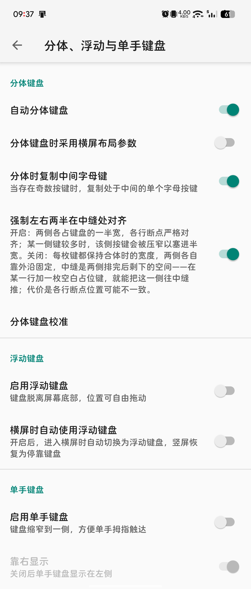
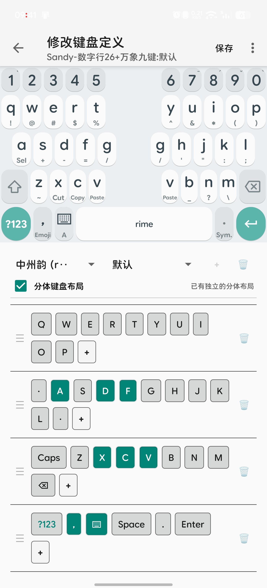

# 分体键盘

屏幕宽度较大的场景（平板、折叠屏展开、横屏）下，键盘左右分成两半，各放一半按键，便于双手握持设备时两根拇指同时输入。

## 启用与配置

入口统一在 **应用主页 → 键盘 → 分体、浮动与单手键盘 → 分体键盘**：

- **自动触发**：屏幕宽度 DP 超过阈值（默认 500）且开关开启时自动启用；
- **自动分屏阈值**：自适应屏幕宽度，可手动覆盖；
- **分体键盘校准**：可视化校准当前屏幕下的分体阈值与中缝间隙参数，算法推荐值不理想时使用；
- **分体时采用横屏布局参数**：按横屏的边距、高度参数渲染，更适配大屏；对折叠屏内屏竖持同样生效；
- **分体时复制中间字母键**（默认开启）：`asdfghjkl` 这类奇数字符行分体时，把几何中间的字母复制成两枚、两半各一枚（如 `asdfg‖ghjkl`），只对**纯字符输出**的字母键与宏键生效；
- **强制左右两半在中缝处对齐**（默认开启）：见下文，关闭可让按键保持原有宽度。

## 智能默认

本版提供智能默认值，多数设备无需手动校准即可获得合理分屏体验；不满意再用校准功能调整。

## 键宽与中缝：两种对齐策略

- **强制对齐（默认）**：两侧各占一半宽度、上下行断点严格对齐；代价是键多的那一侧按键会被**压窄**。
- **关闭强制对齐**：两侧各自靠外沿固定，**每枚键保持布局文件里写的宽度**，中缝变成两侧排完后**挤剩下的空间**——各行断点可能不齐，但按键不再变窄。

关闭对齐后，还可以用**空白占位键**（`PlaceholderKey`，只占位、完全不可交互）把某一侧往中缝方向推：占位键占多宽就把那一侧整体推多远，对分体布局的每一行都生效，也不影响同行其它键宽。唯一例外是含空格键的那一行——中缝由空格自己承担。

## 按方案单独配置分体布局

在**键盘布局编辑器**里勾选方案下拉框下方的 **「分体键盘布局」**，可以为「当前选中的那个子布局」（默认布局或某个方案）单独配一套分体排列；磁盘上写在 `rime:__variant__:split` 等保留键里，没配过的方案自动沿用「默认」那份分体布局。

## 指定断点

按键编辑页勾选 **「分体键盘在本键之后断开」** 可指定该行的断点（同一行勾多个以最后一个为准）；有该标记的行**不再自动复制中间键**——手动分界与自动复制互斥。

## 相关页面

- [浮动键盘](/features/keyboard/float-keyboard)
- [键盘布局编辑器](/features/editor/layout-editor)
- [调整模式](/features/keyboard/adjust-mode)
